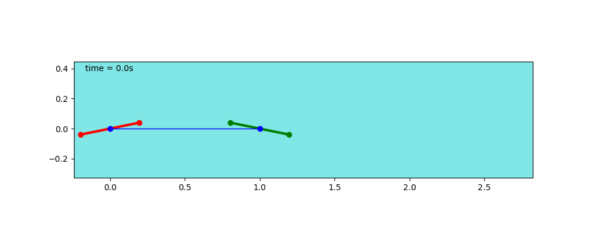
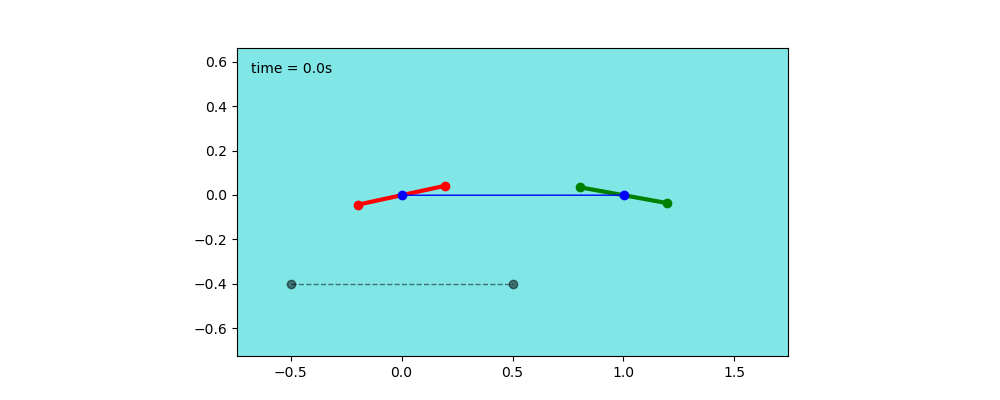

# Dual pvtol, no load

<figure>
	
	<figcaption>Fig1. - dual PVTOL schematics, without load.</figcaption>
</figure>

### 1: Model
 

<button type="button" class="btn btn-info" data-toggle="collapse" data-target="#newton_derivation">Newton model derivation</button>

<button type="button" class="btn btn-info" data-toggle="collapse" data-target="#lagrange_derivation">Lagrange model derivation</button>

  * Generalized coordinates
  
$$q=\begin{pmatrix}x&z&\theta&\phi&\theta_2\end{pmatrix}^T $$

  * Kinematic
  
$$
\begin{cases}
x_2 = x + l \cos{\phi} \\
z_2 = z + l \sin{\phi}
\end{cases}
$$

$$
\begin{cases}
\dot{x}_2 = \dot{x} - l \dot{\phi} \sin{\phi} \\
\dot{z}_2 = \dot{z} + l \dot{\phi} \cos{\phi}
\end{cases}
$$

$$
\begin{cases}
\ddot{x}_2 = \ddot{x} - l( \ddot{\phi} \sin{\phi} + \dot{\phi} \cos{\phi} ) \\
\ddot{z}_2 = \ddot{z} + l( \ddot{\phi} \cos{\phi} - \dot{\phi} \sin{\phi} )
\end{cases}
$$

  * Kinetic energy
  
$$ 
T = \frac{1}{2} m_1 (\dot{x}^2+\dot{z}^2) + \frac{1}{2} J_1 \dot{\theta}^2 +
\frac{1}{2} m_2 (\dot{x}_2^2+\dot{z}_2^2) + \frac{1}{2} J_2 \dot{\theta}_2^2
$$

Introducing our generalized coordinates leads to

$$
T = \frac{1}{2} \left(m_1+m_2\right) (\dot{x}^2+\dot{z}^2) + \frac{1}{2} J_1 \dot{\theta}^2 +
\frac{1}{2} m_2 l\dot{\phi} \left(l\dot{\phi} - 2(\dot{x}\sin\phi-\dot{z}\cos\phi\right)+ 
\frac{1}{2} J_2 \dot{\theta}_2^2
$$

  * Potential energy
  
$$
V = m_1 g z + m_2 g z_2
$$

Introducing our generalized coordinates leads to

$$
V = (m_1+m_2) g z + m_2 g l \sin{\phi}
$$

### Lagrangian

$$\mathcal{L} = T - V $$

 * Partial derivatives

$$ \begin{align*}
\frac{\partial{\mathcal{L}}}{\partial{x}} &=  0 \\ 
\frac{\partial{\mathcal{L}}}{\partial{z}} &=  -(m_1+m_2)g \\
\frac{\partial{\mathcal{L}}}{\partial{\theta}} &=  0 \\
\frac{\partial{\mathcal{L}}}{\partial{\phi}} &=  -m_2l\left(\dot{\phi}(\dot{x}\cos\phi+\dot{z}\sin\phi) + g\cos\phi\right) \\
\frac{\partial{\mathcal{L}}}{\partial{\theta_2}} &=  0 \\
\frac{\partial{\mathcal{L}}}{\partial{\dot{x}}} &=  \left(m_1+m_2\right)\dot{x} - m_2l\dot{\phi}\sin\phi \\
\frac{\partial{\mathcal{L}}}{\partial{\dot{z}}} &= \left(m_1+m_2\right)\dot{z} + m_2l\dot{\phi}\cos\phi \\
\frac{\partial{\mathcal{L}}}{\partial{\dot{\theta}}} &=  J_1\dot{\theta} \\
\frac{\partial{\mathcal{L}}}{\partial{\dot{\phi}}} &= m_2l\left(-\dot{x}\sin\phi +z\cos\phi+l\dot{\phi}\right) \\
\frac{\partial{\mathcal{L}}}{\partial{\dot{\theta_2}}} &=  J_2\dot{\theta}
\end{align*}
$$

### Lagrange equations

  1. $$
\frac{d}{dt}\left( \frac{\partial{\mathcal{L}}}{\partial{\dot{x}}} \right) - \frac{\partial{\mathcal{L}}}{\partial{x}} = F_x
$$

$$
 \left( m_1+m_2 \right) \ddot{x} - m_2l \left( \ddot{\phi}\sin\phi + \dot{\phi}^2\cos\phi \right) = -(f_l+f_r)\sin\theta - (f_{l2}+f_{r2})\sin\theta_2
$$

{:start="2"}
 2. $$
 \frac{d}{dt}\left( \frac{\partial{\mathcal{L}}}{\partial{\dot{z}}} \right) - \frac{\partial{\mathcal{L}}}{\partial{z}} = F_z
$$

$$
 \left( m_1+m_2 \right) (\ddot{z}+g) + m_2l \left( \ddot{\phi}\cos\phi - \dot{\phi}^2\sin\phi \right) = (f_l+f_r)\cos\theta + (f_{l2}+f_{r2})\cos\theta_2
$$

{:start="3"}
  3. $$
 \frac{d}{dt}\left( \frac{\partial{\mathcal{L}}}{\partial{\dot{\theta}}} \right) - \frac{\partial{\mathcal{L}}}{\partial{\theta}} = M_\theta
$$

$$
J_1 \ddot{\theta} = d_1 (-f_l+f_r)
$$

{:start="4"}
  4. $$
 \frac{d}{dt}\left( \frac{\partial{\mathcal{L}}}{\partial{\dot{\theta_2}}} \right) - \frac{\partial{\mathcal{L}}}{\partial{\theta_2}} = M_{\theta_2}
$$

$$
J_2 \ddot{\theta} = d_2 (-f_{l2}+f_{r2})
$$

{:start="5"}
  5. $$ 
\frac{d}{dt}\left( \frac{\partial{\mathcal{L}}}{\partial{\dot{\phi}}} \right) - \frac{\partial{\mathcal{L}}}{\partial{\phi}} = M_\phi
$$

$$
l \ddot{\phi} - \sin\phi \ddot{x} + \cos \phi \ddot{z} = -\cos\phi g + \cos(\phi-\theta_2) \frac{f_{l2}+f_{r2}}{m_2}
$$

### State Space Representation
Using $$X = \begin{pmatrix}x&z&\theta&\phi&\theta_2&\dot{x}&\dot{z}&\dot{\theta}&\dot{\phi}&\dot{\theta_2}\end{pmatrix}^T$$ as state and $$U = \begin{pmatrix}f_l & f_r &f_{l2} & f_{r2} \end{pmatrix}^T$$ as input, a state space representation can be obtained as:

$$
\ddot{\phi} = \frac{m_1}{(m_1+m_2)l} (f_{l2}+f_{r2}) \cos(\phi-\theta_2) - \frac{m_2}{(m_1+m_2)l} (f_{l1}+f_{r1}) \cos(\phi-\theta_1) \\
\ddot{x} =  -u_{t1}*\sin(\theta_1) - u_{t2} \sin(\theta_2) + \frac{l m_1}{m_1+m_2}\left(\ddot{\phi} \sin(\phi)+ \dot{\phi}^2\cos(\phi)\right) \\
\ddot{z} = u_{t1}\cos(\theta_1) + u_{t2}\cos(\theta_2) - g - \frac{l m_2}{m_1+m_2}\left(\ddot{\phi} \cos(\phi)-\dot{\phi}^2 \sin(\phi)\right) \\
\ddot{\theta} = (-f_{l1}+f_{r1})\frac{d_1}{J_1}\\
\ddot{\theta}_2 = (-f_{l2}+f_{r2})\frac{d_2}{J_2}\\

$$

[code](https://github.com/poine/these_ricardo/blob/main/src/dual_no_load.py)

<figure>
	
	<figcaption>Fig1. - open loop</figcaption>
</figure>

[code](https://github.com/poine/these_ricardo/blob/main/src/dual_no_load_test_1.py)

### 2: Control

<figure>
	
	<figcaption>Fig1. - step</figcaption>
</figure>

<figure>
	
	<figcaption>Fig1. - step</figcaption>
</figure>

<figure>
	
	<figcaption>Fig1. - ramp</figcaption>
</figure>
[code](https://github.com/poine/these_ricardo/blob/main/src/dual_no_load_test_2.py)

#### Master slave control
<figure>
	
	
	<figcaption>Fig1. - master slave control</figcaption>
</figure>
[code](https://github.com/poine/these_ricardo/blob/main/src/dual_no_load_test_3.py)
