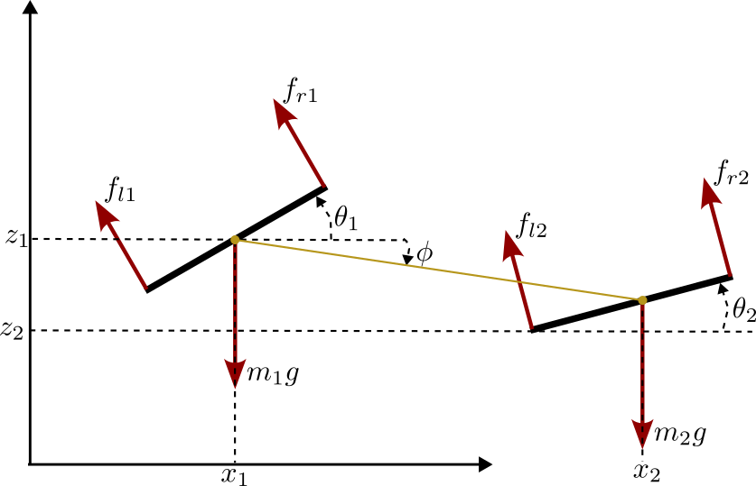

We present here a planar restriction of our VTOL model

## 1: [Single PVTOL](planar_single)

<figure>
	
	<figcaption>Fig1. - PVTOL schematics.</figcaption>
</figure>

## 2: [Single PVTOL with point mass load](planar_single_point_load)

<figure>
	
	<figcaption>Fig1. - PVTOL with point mass load schematics.</figcaption>
</figure>

## 3: [Dual tethered VTOL](planar_dual_no_load)
<figure>
	
	<figcaption>Fig1. - dual PVTOL schematics, without load.</figcaption>
</figure>

## 4: [Dual tethered VTOL with point mass load](planar_dual_point_load)
<figure>
	
	<figcaption>Fig1. - dual PVTOL schematics, point load.</figcaption>
</figure>

## 5: [Dual tethered VTOL with solid load](planar_dual_solid_load)
<figure>
	
	<figcaption>Fig1. - dual PVTOL schematics, solid load.</figcaption>
</figure>
