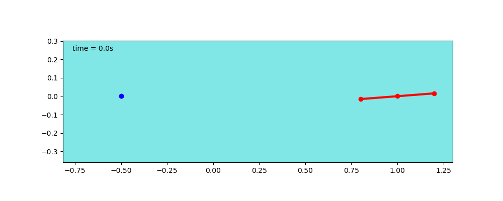
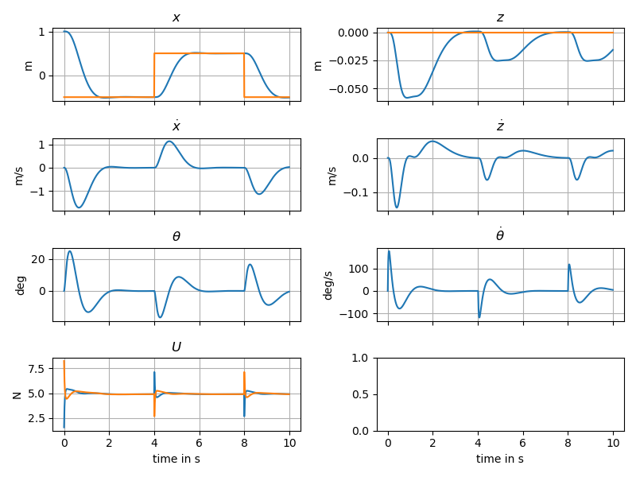
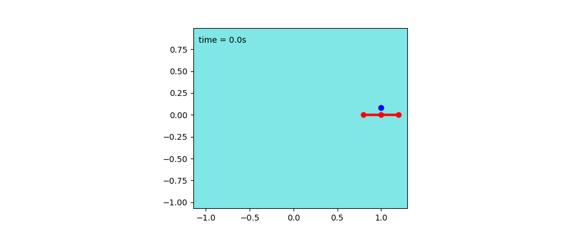
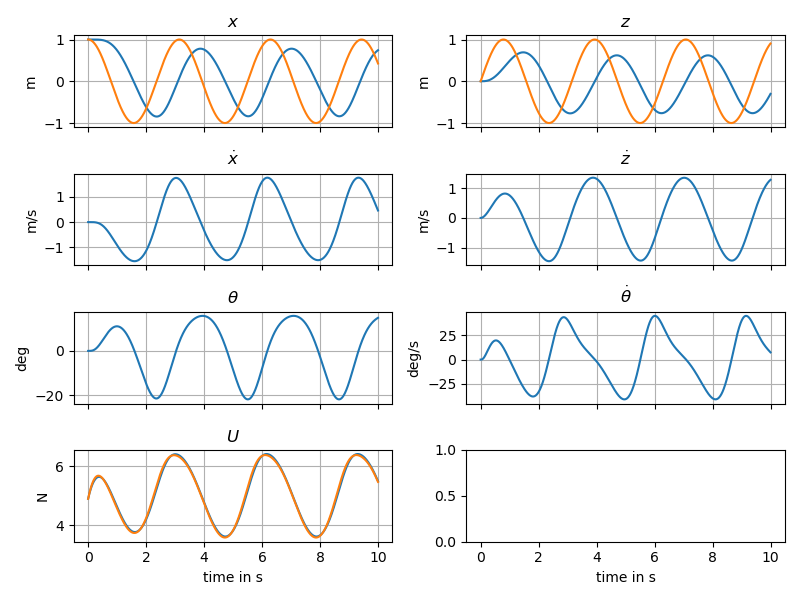
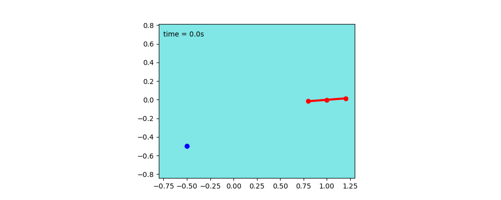
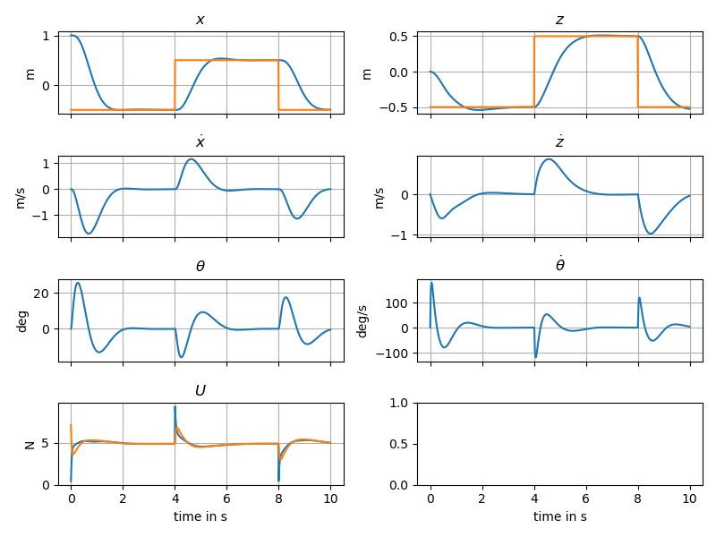
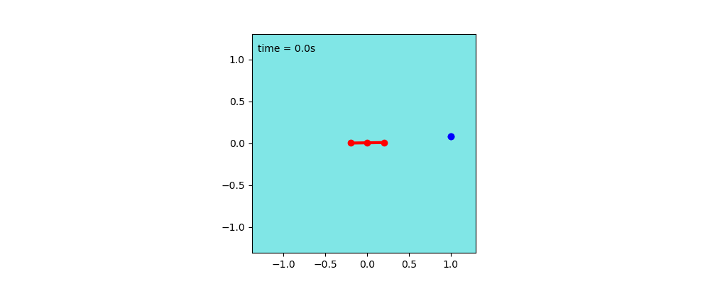
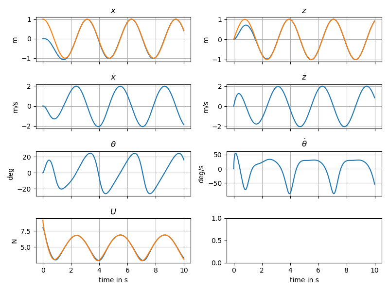

$$
\newcommand{\ddt}[2]{#1^{(#2)}}
$$
<figure>
	
	<figcaption>Fig1. - PVTOL schematics.</figcaption>
</figure>

## 1: Model 
<button type="button" class="btn btn-info" data-toggle="collapse" data-target="#newton_derivation">Newton derivation</button>

Applying Newton's second law to our vehicle in ground frame, we get

$$\begin{align*}
m\ddot{x} &= (f_1+f_2)\sin(\theta) \\
m\ddot{z} &= -mg + (f_1+f_2)\cos(\theta) \\
J\ddot{\theta} &= d(-f_1+f_2)
\end{align*}$$

<button type="button" class="btn btn-info" data-toggle="collapse" data-target="#lagrange_derivation">Lagrange derivation</button>

  * Generalized coordinates
 
$$q=\begin{pmatrix}x&z&\theta\end{pmatrix}^T $$

  * Kinetic energy

$$ T = \frac{1}{2} m(\dot{x}^2+\dot{z}^2) + \frac{1}{2} J \dot{\theta}^2$$

  * Potential energy

$$ V = mgz$$

  * Lagrangian

$$\begin{align*} 
L &= T-V \\
L &= \frac{1}{2} m(\dot{x}^2+\dot{z}^2) + \frac{1}{2} J \dot{\theta}^2 -  mgz
\end{align*}$$

### Partial derivatives

<table>
<tr><td>
$$
\begin{cases}
\frac{\partial{L}}{\partial{x}} =  0 \\
\frac{\partial{L}}{\partial{z}} =  - m g\\
\frac{\partial{L}}{\partial{\theta}} = 0 \\ 
\end{cases}
$$
</td><td>
$$
\begin{cases}
\frac{\partial{L}}{\partial{\dot{x}}} = m\dot{x} \\
\frac{\partial{L}}{\partial{\dot{z}}} = m\dot{z} \\
\frac{\partial{L}}{\partial{\dot{\theta}}} = J \dot{\theta}
\end{cases}
$$
</td></tr>
</table>

### Lagrange equations

 *
 
$$
\frac{d}{dt}\left( \frac{\partial{L}}{\partial{\dot{x}}} \right) - \frac{\partial{L}}{\partial{x}} = F_x
$$

$$
m\ddot{x} = -(f_1+f_2) \sin{\theta}
$$

 *

$$
\frac{d}{dt}\left( \frac{\partial{L}}{\partial{\dot{z}}} \right) - \frac{\partial{L}}{\partial{z}} = F_z
$$

$$
m\ddot{z} + mg = (f_1+f_2) \cos{\theta}
$$

 *

$$
\frac{d}{dt}\left( \frac{\partial{L}}{\partial{\dot{\theta}}} \right) - \frac{\partial{L}}{\partial{\theta}} = M_{\theta}
$$

$$
J\ddot{\theta} = d \left( -f_1+f_2 \right)
$$

 

 
 
### State Space Representation

Using $$X = \begin{pmatrix}x&z&\theta&\dot{x}&\dot{z}&\dot{\theta}\end{pmatrix}^T$$ as state and $$U = \begin{pmatrix}f_1 & f_2 \end{pmatrix}^T$$ as input, a state space represeantation can be obtained as:

$$
\begin{equation}
\dot{X} = f(X,U) = \begin{pmatrix}
  \dot{x} \\
  \dot{z} \\
  \dot{\theta} \\
  -\frac{1}{m}  \sin{\theta} \left( f_1+f_2 \right) \\
  -g + \frac{1}{m}  \cos{\theta} \left( f_1+f_2 \right)\\
  \frac{d}{J} \left( -f_1+f_2 \right)
\end{pmatrix}
\end{equation}
$$

The following input variable change:
$$ 
U' = \begin{pmatrix}u_t\\u_d\end{pmatrix} = \begin{pmatrix}\frac{1}{m}(f_1+f_2) \\ \frac{d}{J}(-f_1+f_2)\end{pmatrix}
$$
leads to the simpler state space representation

$$
\begin{equation}
\dot{X} = f'(X,U') = \begin{pmatrix}
  \dot{x} \\
  \dot{z} \\
  \dot{\theta} \\
  -\sin{\theta}. u_t \\
  -g + \cos{\theta}. u_t\\
  u_d
\end{pmatrix}
\end{equation}
$$

[code](https://github.com/poine/these_ricardo/blob/main/src/single.py)


### 2: Planning <button type="button" class="btn btn-info" data-toggle="collapse" data-target="#single_pvtol_planning">show</button>



### 2: Control 

#### 2.1: Full State Feedback Regulation

<button type="button" class="btn btn-info" data-toggle="collapse" data-target="#single_pvtol_control">show</button>

Here we stabilize the vehicle around an equilibrium $$X_e$$, $$U_e$$ 

$$X_e = \begin{pmatrix}x_e&z_e&0&0&0&0\end{pmatrix}^T$$ 
$$U_e = \begin{pmatrix}mg/2&mg/2\end{pmatrix}^T$$ 

Noting $$\delta X = X-X_e$$ and $$\delta U = U-U_e$$, we obtain the linearized model as

$$
\dot{\delta X} = \begin{pmatrix}0&0&0&1&0&0\\0&0&0&0&1&0\\0&0&0&0&0&1\\
                  0&0&-g&0&0&0\\0&0&0&0&0&0\\0&0&0&0&0&0\end{pmatrix}\delta X +
				  \begin{pmatrix}0&0\\0&0\\0&0\\0&0\\1/m&1/m\\-d/J&d/J\end{pmatrix} \delta U
$$

The linearized system is fully controllable. the non-linear system can hence be stabilized using a state feeback $$U = U_e - K \delta X$$
In the [example](https://github.com/poine/these_ricardo/blob/main/src/single_test_2.py) a gain is computed using LQR, leading to the following simulations;

<figure>
	
	
	<figcaption>Fig1. - step x.</figcaption>
</figure>

<figure>
	
	
	<figcaption>Fig1. - circle.</figcaption>
</figure>

<figure>
	
	
	<figcaption>Fig1. - step z.</figcaption>
</figure>

[code](https://github.com/poine/these_ricardo/blob/main/src/single_test_2.py)

#### 2.2: Trajectory tracking

<button type="button" class="btn btn-info" data-toggle="collapse" data-target="#single_pvtol_control2">show</button>

In the previous part, we notice the regulation showing its limit on the circle example.
In order to improve trajectory following, we will improve the open-loop part of our controller.

The differential flatness property of the vehicle can be leveraged in order to follow a dynamic trajectory $$Yr(t)=\begin{pmatrix}x_r(t), y_r(t)\end{pmatrix}$$

Given a sufficiently smooth trajectory, it is possible to obtain the state vector $$X_r(t)$$ and the input $$U_r(t)$$ from a number of time derivatives of the output $$Y_r$$

$$
X_r = \begin{pmatrix} \ddt{x}{0} \\ \ddt{z}{0} \\ -\arctan\frac{\ddt{x}{2}}{\ddt{z}{2}+g} \\
\ddt{x}{1} \\ \ddt{z}{1} \\
-\frac{\left(\ddt{z}{2}+g\right)\ddt{x}{3} - \ddt{x}{2}\ddt{z}{3}} 
    {\left(\ddt{z}{2}+g\right)^2 + \left(\ddt{x}{2}\right)^2} \end{pmatrix}
$$

$$
U_r =
\begin{pmatrix}
  \sqrt{\left(\ddt{x}{2}\right)^2 + \left(\ddt{z}{2}+g\right)^2}\\
  \frac{\left[\ddt{x}{4}(\ddt{z}{2}+g)-\ddt{z}{4}\ddt{x}{2}\right]
    \left[(\ddt{z}{2}+g)^2 + (\ddt{x}{2})^2\right] -
    \left[2(\ddt{z}{2}+g)\ddt{z}{3} + 2\ddt{x}{2}\ddt{x}{3}\right]
    \left[\ddt{x}{3}(\ddt{z}{2}+g) - \ddt{z}{3}\ddt{x}{2}\right]}
  {\left(\left(\ddt{z}{2}+g\right)^2 + \left(\ddt{x}{2}\right)^2\right)^2}\\
\end{pmatrix}
$$

The controller 
$$
U = U_r + K(X-X_r)
$$
can be show to achieve perfect trajectory traking while providing asymptotically stable error rejection.

<figure>
	
	
	<figcaption>Fig1. - circle tracking.</figcaption>
</figure>
[code](https://github.com/poine/these_ricardo/blob/main/src/single_test_3.py)

#### 2.3: Reference Model

<button type="button" class="btn btn-info" data-toggle="collapse" data-target="#single_pvtol_control3">show</button>

