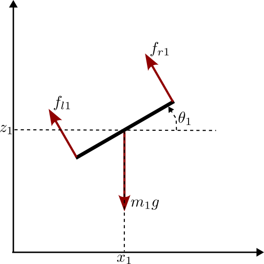

<figure>
	
	<figcaption>Fig1. - PVTOL schematics.</figcaption>
</figure>

## 1: Model 
<button type="button" class="btn btn-info" data-toggle="collapse" data-target="#newton_derivation">Newton derivation</button>

Trivial

<button type="button" class="btn btn-info" data-toggle="collapse" data-target="#lagrange_derivation">Lagrange derivation</button>

  * Generalized coordinates
 
$$q=\begin{pmatrix}x&z&\theta\end{pmatrix}^T $$

  * Kinetic energy

$$ T = \frac{1}{2} m(\dot{x}^2+\dot{z}^2) + \frac{1}{2} J \dot{\theta}^2$$

  * Potential energy

$$ V = mgz$$

  * Lagrangian

$$\begin{align*} 
L &= T-V \\
L &= \frac{1}{2} m(\dot{x}^2+\dot{z}^2) + \frac{1}{2} J \dot{\theta}^2 -  mgz
\end{align*}$$

<table>
<tr><td>
$$
\begin{cases}
\frac{\partial{L}}{\partial{x}} =  0 \\
\frac{\partial{L}}{\partial{z}} =  - m g\\
\frac{\partial{L}}{\partial{\theta}} = 0 \\ 
\end{cases}
$$
</td><td>
$$
\begin{cases}
\frac{\partial{L}}{\partial{\dot{x}}} = m\dot{x} \\
\frac{\partial{L}}{\partial{\dot{z}}} = m\dot{z} \\
\frac{\partial{L}}{\partial{\dot{\theta}}} = J \dot{\theta}
\end{cases}
$$
</td></tr>
</table>

### Lagrange Equations

 *
 
$$
\frac{d}{dt}\left( \frac{\partial{L}}{\partial{\dot{x}}} \right) - \frac{\partial{L}}{\partial{x}} = F_x
$$

$$
m\ddot{x} = -(f_1+f_2) \sin{\theta}
$$

 *

$$
\frac{d}{dt}\left( \frac{\partial{L}}{\partial{\dot{z}}} \right) - \frac{\partial{L}}{\partial{z}} = F_z
$$

$$
m\ddot{z} + mg = (f_1+f_2) \cos{\theta}
$$

 *

$$
\frac{d}{dt}\left( \frac{\partial{L}}{\partial{\dot{\theta}}} \right) - \frac{\partial{L}}{\partial{\theta}} = M_{\theta}
$$

$$
J\ddot{\theta} = l \left( -f_1+f_2 \right)
$$
 

 
 
### State Space Representation

Using $$X = \begin{pmatrix}x&z&\theta&\dot{x}&\dot{z}&\dot{\theta}\end{pmatrix}^T$$ as state and $$U = \begin{pmatrix}f_1 & f_2 \end{pmatrix}^T$$ as input, a state space represeantation can be obtained as:

$$
\begin{equation}
\dot{X} = f(X,U) = \begin{pmatrix}
  \dot{x} \\
  \dot{z} \\
  \dot{\theta} \\
  -\frac{1}{m}  \sin{\theta} \left( f_1+f_2 \right) \\
  -g + \frac{1}{m}  \cos{\theta} \left( f_1+f_2 \right)\\
  \frac{l}{J} \left( -f_1+f_2 \right)
\end{pmatrix}
\end{equation}
$$

The following input variable change:
$$ 
U' = \begin{pmatrix}u_t\\u_d\end{pmatrix} = \begin{pmatrix}\frac{1}{m}(f_1+f_2) \\ \frac{-l}{J}(f_1-f_2)\end{pmatrix}
$$
leads to the simpler state space representation

$$
\begin{equation}
\dot{X} = f'(X,U') = \begin{pmatrix}
  \dot{x} \\
  \dot{z} \\
  \dot{\theta} \\
  -\sin{\theta}. u_t \\
  -g + \cos{\theta}. u_t\\
  u_d
\end{pmatrix}
\end{equation}
$$

### 2: Planning <button type="button" class="btn btn-info" data-toggle="collapse" data-target="#single_pvtol_planning">show</button>

### 3: Control <button type="button" class="btn btn-info" data-toggle="collapse" data-target="#single_pvtol_control">show</button>

<figure>
	
	<figcaption>Fig1. - PVTOL schematics.</figcaption>
</figure>

