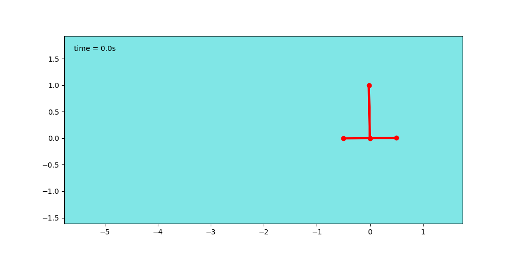

<figure>
	
	<figcaption>Fig1. - PVTOL with point mass load schematics.</figcaption>
</figure>

### 1: Model <button type="button" class="btn btn-info" data-toggle="collapse" data-target="#single_tethered_pvtol_model">show</button>

We will start by deriving a dynamic model for the PVTOL with pole system.

It can be seen that the vector $$q=\begin{pmatrix}x&z&\theta&\phi\end{pmatrix}^T $$ can be used a generalized coordinates as it uniquely describes the configuration of the system.

### Kinematic

Assumingt that the pole is constrained to pivot at the center of the PVTOL, the position of the center of mass of the pole is then given by:

$$
\begin{cases}
x_p = x - l \sin{\phi} \\
z_p = z + l \cos{\phi}
\end{cases}
$$

Computing the time derivative of the above equation, we get the velocity of the pole's center of mass as:

$$
\begin{cases}
\dot{x}_p = \dot{x} - l \dot{\phi} \cos{\phi} \\
\dot{z}_p = \dot{z} - l \dot{\phi} \sin{\phi}
\end{cases}
$$

<!--
Computing yet another time derivative, the acceleration of the pole's center of mass is obtained as:

$$
\begin{cases}
\ddot{x}_p = \ddot{x} - l \left(\ddot{\phi}\cos{\phi} - \dot{\phi}^2 \sin{\phi}\right) \\
\ddot{z}_p = \ddot{z} - l \left(\ddot{\phi}\sin{\phi} + \dot{\phi}^2 \cos{\phi}\right)
\end{cases}
$$
-->

Noting $$v^2=\dot{x}^2+\dot{z}^2$$ and $$v_p^2=\dot{x}_p^2+\dot{z}_p^2$$, the relationship between the pvtol and pole centers of mass velocities is expressed as:

$$
v_p^2 = \dot{x}^2 + \dot{z}^2 + l^2\dot{\phi}^2 -2l\dot{\phi}\left( \dot{x}\cos{\phi}+\dot{z}\sin{\phi}\right)
$$

$$
v_p^2 = v^2 + l^2\dot{\phi}^2 -2l\dot{\phi}\left( \dot{x}\cos{\phi}+\dot{z}\sin{\phi}\right)
$$

### Energy

<table>
<tr><td></td><th>Kinetic Energy</th><th>Potential Energy</th></tr>
<tr><th>pvtol</th>
<td>$$ T_v = \frac{1}{2} Mv^2 + \frac{1}{2} J \dot{\theta}^2$$</td>
<td>$$ V_v = Mgz$$</td></tr>
<tr><th>pole</th>
<td>$$ T_p = \frac{1}{2} mv_p^2 + \frac{1}{2} j \dot{\phi}^2$$</td>
<td>$$ V_p = mgz_p$$</td></tr>
</table>

### Lagrangian

$$
\mathscr{L} = T - V
$$

$$
\mathscr{L} = \frac{1}{2}Mv^2 +  \frac{1}{2} J \dot{\theta}^2 +\frac{1}{2}mv_p^2 + \frac{1}{2} j \dot{\phi}^2 -  Mgz - mgz_p
$$

<!--
$$
\begin{multline}
L = \frac{1}{2}M\left( \dot{x}^2 + \dot{z}^2 \right)
    + \frac{1}{2} J \dot{\theta}^2 \\
	+ \frac{1}{2}m\left( \left( \dot{x}^2 + \dot{z}^2 \right) + l^2\dot{\phi}^2 -2l\dot{\phi}\left( \dot{x}\cos{\phi}+\dot{z}\sin{\phi}\right) \right)
	+ \frac{1}{2} j \dot{\phi}^2 \\
	-  Mgz 
	- mg \left(z + l \cos{\phi}\right)
\end{multline}
$$
-->

Expanding with state variables, we get:

$$
\begin{multline}
\mathscr{L} = \frac{1}{2} \left( M+m \right)  \left( \dot{x}^2 + \dot{z}^2 \right) + \frac{1}{2} J \dot{\theta}^2 + \frac{1}{2} j \dot{\phi}^2 \\
+ \frac{1}{2}m\left( l^2\dot{\phi}^2 -2l\dot{\phi}\left( \dot{x}\cos{\phi}+\dot{z}\sin{\phi}\right) \right)
- \left( M+m \right) g z - mgl \cos{\phi}
\end{multline}
$$

Partial derivatives of the Lagrangian with respect to the state vector components are:

$$
\begin{cases}
\frac{\partial{\mathscr{L}}}{\partial{x}} =  0 \\
\frac{\partial{\mathscr{L}}}{\partial{z}} =  - \left( M+m \right) g\\
\frac{\partial{\mathscr{L}}}{\partial{\theta}} = 0 \\ 
\frac{\partial{\mathscr{L}}}{\partial{\phi}} = ml \left( \dot{\phi} \left( \dot{x}\sin{\phi} - \dot{z}\cos{\phi}\right) + g \sin{\phi}\right)\\
\frac{\partial{\mathscr{L}}}{\partial{\dot{x}}} =  \left( M+m \right) \dot{x} - ml\dot{\phi}\cos{\phi}\\
\frac{\partial{\mathscr{L}}}{\partial{\dot{z}}} =  \left( M+m \right) \dot{z} - ml\dot{\phi}\sin{\phi}\\
\frac{\partial{\mathscr{L}}}{\partial{\dot{\theta}}} = J \dot{\theta}\\ 
\frac{\partial{\mathscr{L}}}{\partial{\dot{\phi}}} = j \dot{\phi} + ml \left( l\dot{\phi} - \left( \dot{x}\cos{\phi}+\dot{z}\sin{\phi} \right)\right)\\
\end{cases}
$$

### Lagrange Equations

 *
 
$$
\frac{d}{dt}\left( \frac{\partial{\mathscr{L}}}{\partial{\dot{x}}} \right) - \frac{\partial{\mathscr{L}}}{\partial{x}} = F_x
$$

$$
\left( M+m \right) \ddot{x} - ml \left( \ddot{\phi} \cos{\phi} - \dot{\phi}^2\sin{\phi}\right) = -(f_1+f_2) \sin{\theta}
$$

 *
 
$$
\frac{d}{dt}\left( \frac{\partial{\mathscr{L}}}{\partial{\dot{z}}} \right) - \frac{\partial{\mathscr{L}}}{\partial{z}} = F_z
$$

$$
\left( M+m \right) \ddot{z} - ml \left( \ddot{\phi} \sin{\phi} + \dot{\phi}^2\cos{\phi}\right) + \left( M+m \right) g = (f_1+f_2) \cos{\theta}
$$

*

$$
\frac{d}{dt}\left( \frac{\partial{\mathscr{L}}}{\partial{\dot{\theta}}} \right) - \frac{\partial{\mathscr{L}}}{\partial{\theta}} = M_{\theta}
$$

$$
J\ddot{\theta} = L \left( -f_1+f_2 \right)
$$

*

$$
\frac{d}{dt}\left( \frac{\partial{\mathscr{L}}}{\partial{\dot{\phi}}} \right) - \frac{\partial{\mathscr{L}}}{\partial{\phi}} = 0
$$

$$
(j+ml^2)\ddot{\phi} - ml \left( \ddot{x}\cos{\phi} + (\ddot{z}+g)\sin{\phi} \right) = 0
$$

### State Space Representation
 We have now obtained 4 coupled ODEs that needs to be uncoupled to obtain a SSR.
 
$$
\begin{cases}
\ddot{x} - \frac{ml}{M+m} \cos{\phi} \ddot{\phi} = - \frac{ml}{M+m} \sin{\phi} \dot{\phi}^2 - \frac{1}{M+m} \sin{\theta} (f_1 +f_2) \\
\ddot{z} - \frac{ml}{M+m} \sin{\phi} \ddot{\phi} = \frac{ml}{M+m} \cos{\phi} \dot{\phi}^2 -g + \frac{1}{M+m}  \cos{\theta} (f_1 +f_2) \\
\ddot{\theta} = \frac{L}{J}(-f_1+f_2) \\
\ddot{\phi} -\frac{ml}{j+ml^2}\left( \ddot{x} \cos{\phi} + (\ddot{z} + g) \sin{\phi} \right) = 0 
\end{cases}
$$

The above can be matricially rewritten as a linear system:
<!--
$$
  \begin{pmatrix}
  1 & 0 & a & 0 \\
  0 & 1 & b & 0 \\
  0 & 0 & 0 & 1 \\
  c & d & 1 & 0
  \end{pmatrix}
  \begin{pmatrix}
  \ddot{x}\\ \ddot{z} \\ \ddot{\phi} \\ \ddot{\theta}
  \end{pmatrix} =
  \begin{pmatrix}
  e \\ f \\ g \\ 0
  \end{pmatrix}
$$
-->
$$
  \begin{pmatrix}
  1 & 0 & 0 & a \\
  0 & 1 & 0 & b \\
  0 & 0 & 1 & 0 \\
  c & d & 0 & 1
  \end{pmatrix}
  \begin{pmatrix}
  \ddot{x}\\ \ddot{z} \\ \ddot{\theta} \\ \ddot{\phi}
  \end{pmatrix} =
  \begin{pmatrix}
  e \\ f \\ g \\ h
  \end{pmatrix}
$$

The system has full rank ( $$det(A) = 1$$ ).

<figure>
	
	
	<figcaption>Fig1. - open loop</figcaption>
</figure>
 
[code](https://github.com/poine/these_ricardo/blob/main/src/single_point_load.py)

[code](https://github.com/poine/these_ricardo/blob/main/src/single_point_load_test_1.py)

### 2: Control

<figure>
	
	
	<figcaption>Fig1. - step x.</figcaption>
</figure>
 
[code](https://github.com/poine/these_ricardo/blob/main/src/single_point_load_test_2.py)
